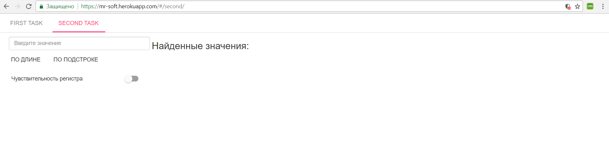

# Тестовое задание для MrSoft.by [](https://travis-ci.org/pkukharenka/mrSoft)

 Spring boot + AngularJS application. Демо - https://mr-soft.herokuapp.com/

### Запуск приложения на локальной машине
```
git clone https://github.com/pkukharenka/mrSoft.git
cd mr-test
./mvnw spring-boot:run
```

*Доступ к приложению можно получить по адресу: http://localhost:8080/*

## Первое задание (First task):


*Окно добавления (редактирования) категорий товаров позволяет добавлять, редактировать
и удалять категории товаров.*


*Окно добавления (редактирования) товара предусматривает валидацию вводимых данных 
на стороне клиента.*


## Второе задание (Second task):



*Второе задание включает в себя поле для ввода пользовательских данных, две
кнопки (ПО ДЛИНЕ и ПО ПОДСТРОКЕ), при нажатии на которые производится выборка значений в
соответствии с введенными данными, а также кнопки для включения/выключения чувствительности регистра
при выборке значений ПО ПОДСТРОКЕ.*

## Примечание

**Для функционирования второй задачи (Second Task) необходимо наличие плагина CORS, т.к.
сервер, к котрому обращается приложение для получения данных
не поддерживает кроссдоменные запросы.**

## Database configuration

По умолчанию тестовое приложение использует in-memory database H2, которая
заполняется при запуске данными из фалйла ./resources/data.sql. 


