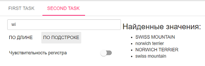

[](https://travis-ci.org/pkukharenka/mrSoft)
[](https://codecov.io/gh/pkukharenka/mrSoft)

# Spring boot + AngularJS + OpenCsv application.

Demo you can see by this url - https://mr-soft.herokuapp.com/

### Start application locally
```
git clone https://github.com/pkukharenka/mrSoft.git
cd mr-test
./mvnw spring-boot:run
```

*After launching the application, it will be available at - http://localhost:8080/*

## First task:


*The window for adding (editing) product categories allows you to add, edit
 and delete product categories*


*The window for adding (editing) the products provides the validation of the input data
 on the client side*


*The application allows you to download product data into a .csv file*


*Also, the application allows you to upload product data into a database from the .csv file format.*


## Second task:

   

*The second task includes a field for entering user data, two
 buttons (by LENGTH and by SUBSTRING), when you click on which you select the values ​​in
 according to the entered data, and also buttons for switching on / off the sensitivity of the register
 when sampling the values ​​of the SUBSTRING software.
 The peculiarity of the second task is the use of a proxy to execute a query on the required URL,
 since the server to which the application accesses to retrieve data does not support cross-domain queries.*


## Database configuration

By default, the test application uses the in-memory database H2, which
filled when starting from the file ./resources/data.sql. 


